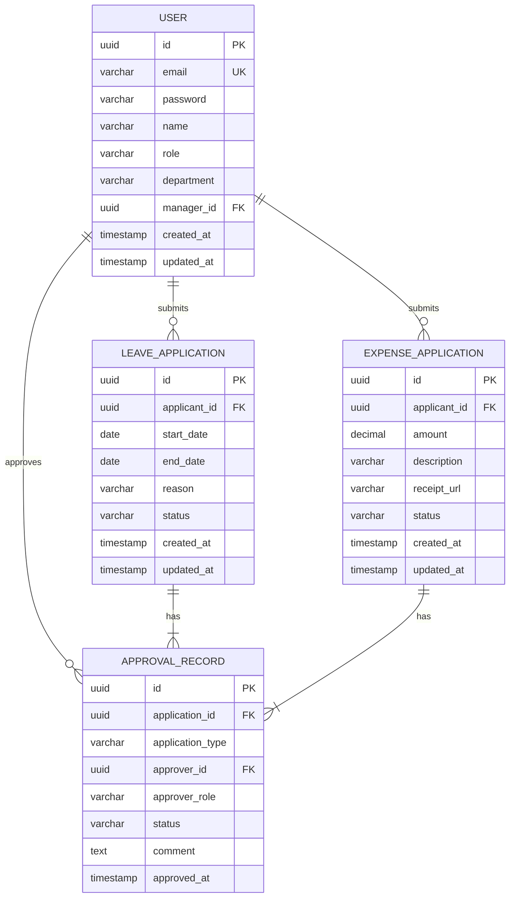
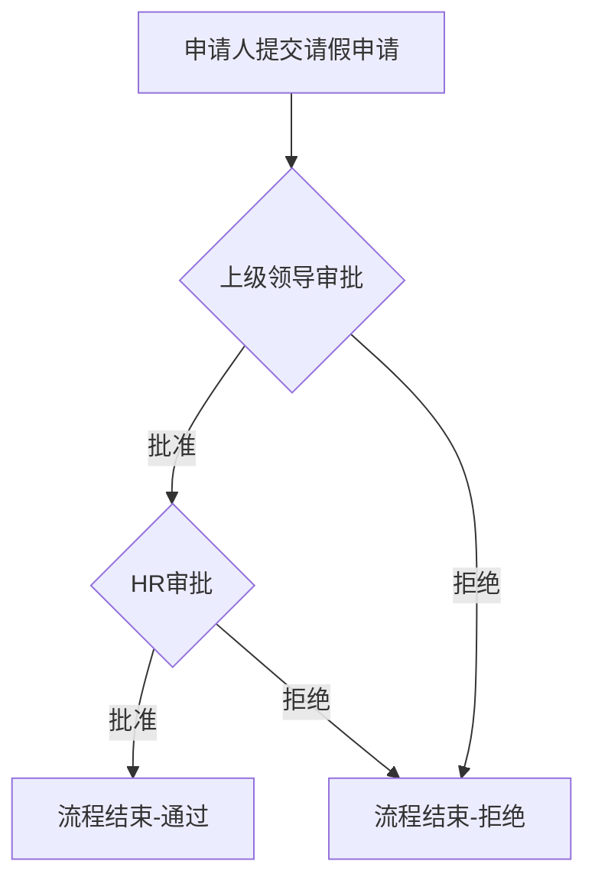
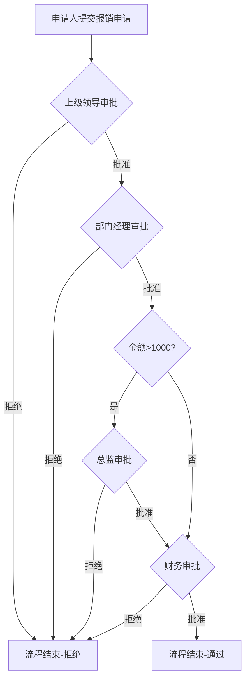

# 全业务审批系统 - 后端实现规划

## 1. 需求分析

### 1.1 业务流程概述

#### 请假流程
```
申请人填写表单 → 上级领导批准 → HR批准（可多人审批）→ 结束
```

#### 报销流程
```
申请人填写表单 → 上级领导批准 → 部门经理批准 → [金额>1000时：总监审批] → 财务批准（可多人审批）→ 结束
```

### 1.2 核心功能需求

| 需求编号 | 功能模块 | 功能描述 |
| :--- | :--- | :--- |
| REQ-001 | 用户管理 | 用户注册、登录、角色分配 |
| REQ-002 | 请假申请 | 员工提交请假申请表单 |
| REQ-003 | 报销申请 | 员工提交报销申请表单 |
| REQ-004 | 审批流程 | 多级审批、多人审批支持 |
| REQ-005 | 流程引擎 | 动态流程路由（根据金额判断是否需要总监审批） |
| REQ-006 | 状态管理 | 审批状态流转追踪 |
| REQ-007 | 通知功能 | 审批提醒、状态变更通知 |

### 1.3 流程状态定义

| 状态码 | 状态名称 | 说明 |
| :--- | :--- | :--- |
| PENDING | 待审批 | 申请已提交，等待审批 |
| APPROVED | 已批准 | 当前节点批准通过 |
| REJECTED | 已拒绝 | 审批被拒绝 |
| COMPLETED | 已完成 | 所有节点审批通过 |
| CANCELLED | 已取消 | 申请人主动取消 |

---

## 2. 技术架构

### 2.1 技术栈

| 分类 | 技术 | 版本 | 说明 |
| :--- | :--- | :--- | :--- |
| 语言 | TypeScript | 5.x | 类型安全的JavaScript超集 |
| 框架 | NestJS | 10.x | Node.js企业级框架 |
| 数据库 | PostgreSQL | 16.x | 关系型数据库，支持复杂查询 |
| ORM | TypeORM | 0.3.x | 对象关系映射工具 |
| Docker | Docker Compose | 2.x | 容器化部署 |
| 认证 | JWT | - | JSON Web Token认证 |
| API文档 | Swagger | - | 自动API文档生成 |

### 2.2 架构设计

#### 2.2.1 模块划分

```
src/
├── app.module.ts          # 根模块
├── main.ts                # 应用入口
├── auth/                  # 认证模块
│   ├── auth.module.ts
│   ├── auth.controller.ts
│   ├── auth.service.ts
│   ├── jwt.strategy.ts
│   └── dto/
├── users/                 # 用户管理模块
│   ├── users.module.ts
│   ├── users.controller.ts
│   ├── users.service.ts
│   ├── user.entity.ts
│   └── dto/
├── leave/                 # 请假流程模块
│   ├── leave.module.ts
│   ├── leave.controller.ts
│   ├── leave.service.ts
│   ├── leave.entity.ts
│   └── dto/
├── expense/               # 报销流程模块
│   ├── expense.module.ts
│   ├── expense.controller.ts
│   ├── expense.service.ts
│   ├── expense.entity.ts
│   └── dto/
├── approval/              # 审批引擎模块
│   ├── approval.module.ts
│   ├── approval.controller.ts
│   ├── approval.service.ts
│   ├── approval.entity.ts
│   └── dto/
├── workflow/              # 工作流引擎模块
│   ├── workflow.module.ts
│   ├── workflow.service.ts
│   └── workflow.engine.ts
└── shared/                # 共享模块
    ├── shared.module.ts
    └── utils/
```

#### 2.2.2 核心实体关系



#### 2.2.3 审批流程图

##### 请假流程


##### 报销流程


---

## 3. 数据库设计

### 3.1 用户表 (users)

| 字段名 | 类型 | 约束 | 说明 |
| :--- | :--- | :--- | :--- |
| id | UUID | PRIMARY KEY | 用户唯一标识 |
| email | VARCHAR(255) | UNIQUE, NOT NULL | 邮箱地址 |
| password | VARCHAR(255) | NOT NULL | 加密后的密码 |
| name | VARCHAR(100) | NOT NULL | 用户姓名 |
| role | VARCHAR(50) | NOT NULL | 用户角色：EMPLOYEE, MANAGER, HR, FINANCE, DIRECTOR |
| department | VARCHAR(100) | | 部门名称 |
| manager_id | UUID | FOREIGN KEY | 上级领导ID |
| created_at | TIMESTAMP | DEFAULT CURRENT_TIMESTAMP | 创建时间 |
| updated_at | TIMESTAMP | DEFAULT CURRENT_TIMESTAMP | 更新时间 |

### 3.2 请假申请表 (leave_applications)

| 字段名 | 类型 | 约束 | 说明 |
| :--- | :--- | :--- | :--- |
| id | UUID | PRIMARY KEY | 申请唯一标识 |
| applicant_id | UUID | FOREIGN KEY, NOT NULL | 申请人ID |
| start_date | DATE | NOT NULL | 请假开始日期 |
| end_date | DATE | NOT NULL | 请假结束日期 |
| reason | VARCHAR(500) | | 请假原因 |
| status | VARCHAR(20) | NOT NULL, DEFAULT 'PENDING' | 申请状态 |
| created_at | TIMESTAMP | DEFAULT CURRENT_TIMESTAMP | 创建时间 |
| updated_at | TIMESTAMP | DEFAULT CURRENT_TIMESTAMP | 更新时间 |

### 3.3 报销申请表 (expense_applications)

| 字段名 | 类型 | 约束 | 说明 |
| :--- | :--- | :--- | :--- |
| id | UUID | PRIMARY KEY | 申请唯一标识 |
| applicant_id | UUID | FOREIGN KEY, NOT NULL | 申请人ID |
| amount | DECIMAL(10,2) | NOT NULL | 报销金额 |
| description | VARCHAR(500) | | 报销说明 |
| receipt_url | VARCHAR(500) | | 发票附件URL |
| status | VARCHAR(20) | NOT NULL, DEFAULT 'PENDING' | 申请状态 |
| created_at | TIMESTAMP | DEFAULT CURRENT_TIMESTAMP | 创建时间 |
| updated_at | TIMESTAMP | DEFAULT CURRENT_TIMESTAMP | 更新时间 |

### 3.4 审批记录表 (approval_records)

| 字段名 | 类型 | 约束 | 说明 |
| :--- | :--- | :--- | :--- |
| id | UUID | PRIMARY KEY | 审批记录唯一标识 |
| application_id | UUID | NOT NULL | 关联申请ID |
| application_type | VARCHAR(20) | NOT NULL | 申请类型：LEAVE, EXPENSE |
| approver_id | UUID | FOREIGN KEY, NOT NULL | 审批人ID |
| approver_role | VARCHAR(50) | NOT NULL | 审批人角色 |
| status | VARCHAR(20) | NOT NULL | 审批状态 |
| comment | TEXT | | 审批意见 |
| approved_at | TIMESTAMP | | 审批时间 |

---

## 4. API 接口设计

### 4.1 认证接口

| HTTP方法 | 路径 | 功能描述 | Controller |
| :--- | :--- | :--- | :--- |
| POST | /auth/login | 用户登录 | AuthController |
| POST | /auth/register | 用户注册 | AuthController |

#### 登录请求体
```json
{
    "email": "string",
    "password": "string"
}
```

#### 登录响应体
```json
{
    "access_token": "string",
    "user": {
        "id": "uuid",
        "email": "string",
        "name": "string",
        "role": "string",
        "department": "string"
    }
}
```

### 4.2 用户管理接口

| HTTP方法 | 路径 | 功能描述 | Controller |
| :--- | :--- | :--- | :--- |
| GET | /users | 获取用户列表 | UsersController |
| GET | /users/:id | 获取用户详情 | UsersController |
| POST | /users | 创建用户 | UsersController |
| PUT | /users/:id | 更新用户信息 | UsersController |
| DELETE | /users/:id | 删除用户 | UsersController |

### 4.3 请假流程接口

| HTTP方法 | 路径 | 功能描述 | Controller |
| :--- | :--- | :--- | :--- |
| POST | /leave/apply | 提交请假申请 | LeaveController |
| GET | /leave | 获取请假申请列表 | LeaveController |
| GET | /leave/:id | 获取请假申请详情 | LeaveController |
| PUT | /leave/:id/approve | 审批请假申请 | LeaveController |
| PUT | /leave/:id/reject | 拒绝请假申请 | LeaveController |
| DELETE | /leave/:id | 取消请假申请 | LeaveController |

#### 提交请假申请请求体
```json
{
    "startDate": "2024-01-01",
    "endDate": "2024-01-03",
    "reason": "string"
}
```

#### 审批请求体
```json
{
    "comment": "string"
}
```

### 4.4 报销流程接口

| HTTP方法 | 路径 | 功能描述 | Controller |
| :--- | :--- | :--- | :--- |
| POST | /expense/apply | 提交报销申请 | ExpenseController |
| GET | /expense | 获取报销申请列表 | ExpenseController |
| GET | /expense/:id | 获取报销申请详情 | ExpenseController |
| PUT | /expense/:id/approve | 审批报销申请 | ExpenseController |
| PUT | /expense/:id/reject | 拒绝报销申请 | ExpenseController |
| DELETE | /expense/:id | 取消报销申请 | ExpenseController |

#### 提交报销申请请求体
```json
{
    "amount": 1200.00,
    "description": "string",
    "receiptUrl": "string"
}
```

---

## 5. 部署与配置

### 5.1 Docker 配置

#### docker-compose.yml
```yaml
version: '3.8'

services:
  postgres:
    image: postgres:16-alpine
    container_name: bmp_postgres
    ports:
      - "5432:5432"
    environment:
      POSTGRES_DB: bmp_db
      POSTGRES_USER: bmp_user
      POSTGRES_PASSWORD: bmp_password
    volumes:
      - postgres_data:/var/lib/postgresql/data
    healthcheck:
      test: ["CMD-SHELL", "pg_isready -U bmp_user -d bmp_db"]
      interval: 30s
      timeout: 10s
      retries: 3

  backend:
    build:
      context: .
      dockerfile: Dockerfile
    container_name: bmp_backend
    ports:
      - "3000:3000"
    environment:
      DB_HOST: postgres
      DB_PORT: 5432
      DB_NAME: bmp_db
      DB_USER: bmp_user
      DB_PASSWORD: bmp_password
      JWT_SECRET: your_jwt_secret_here
    depends_on:
      postgres:
        condition: service_healthy
    volumes:
      - .:/app
      - /app/node_modules

volumes:
  postgres_data:
```

#### Dockerfile
```dockerfile
FROM node:20-alpine

WORKDIR /app

COPY package*.json ./

RUN npm ci --only=production

COPY . .

RUN npm run build

EXPOSE 3000

CMD ["node", "dist/main"]
```

### 5.2 环境变量配置

| 变量名 | 说明 | 默认值 |
| :--- | :--- | :--- |
| PORT | 服务端口 | 3000 |
| DB_HOST | 数据库主机 | postgres |
| DB_PORT | 数据库端口 | 5432 |
| DB_NAME | 数据库名称 | bmp_db |
| DB_USER | 数据库用户名 | bmp_user |
| DB_PASSWORD | 数据库密码 | bmp_password |
| JWT_SECRET | JWT密钥 | - |
| JWT_EXPIRES_IN | JWT过期时间 | 1d |

---

## 6. 安全性考虑

### 6.1 认证与授权

- 使用 JWT 进行身份认证
- 基于角色的访问控制（RBAC）
- 密码使用 bcrypt 加密存储

### 6.2 输入验证

- 使用 NestJS 的 Pipe 进行请求参数验证
- 防止 SQL 注入（TypeORM 自动参数化）
- XSS 攻击防护

### 6.3 权限控制

| 角色 | 权限 |
| :--- | :--- |
| EMPLOYEE | 提交申请、查看自己的申请 |
| MANAGER | 审批下属申请、查看部门申请 |
| HR | 审批请假申请、查看所有申请 |
| FINANCE | 审批报销申请、查看所有报销 |
| DIRECTOR | 审批大额报销、查看部门申请 |

---

## 7. 实现步骤

| 步骤 | 任务 | 描述 | 预计耗时 |
| :--- | :--- | :--- | :--- |
| 1 | 项目初始化 | 创建 NestJS 项目，安装依赖 | 1h |
| 2 | 数据库配置 | 配置 TypeORM，创建实体 | 2h |
| 3 | 认证模块 | 实现 JWT 认证、用户注册登录 | 2h |
| 4 | 用户模块 | 用户 CRUD 操作 | 1.5h |
| 5 | 请假流程 | 请假申请提交、审批流程 | 3h |
| 6 | 报销流程 | 报销申请提交、动态审批流程 | 3h |
| 7 | 工作流引擎 | 流程路由、状态管理 | 2h |
| 8 | Docker部署 | 配置 Docker Compose | 1h |
| 9 | 测试验证 | 单元测试、接口测试 | 2h |

---

## 8. 风险与注意事项

### 8.1 风险识别

| 风险 | 描述 | 应对措施 |
| :--- | :--- | :--- |
| 流程复杂度 | 报销流程根据金额动态调整 | 使用工作流引擎动态路由 |
| 多人审批 | HR和财务可能需要多人审批 | 审批记录表支持多条记录 |
| 并发问题 | 多人同时审批同一申请 | 使用数据库事务和乐观锁 |
| 权限控制 | 确保正确的人审批正确的申请 | 严格的角色权限校验 |

### 8.2 注意事项

1. 审批流程需要支持并行审批（如HR多人审批）
2. 需要记录完整的审批历史，便于追溯
3. 审批状态变更需要通知相关人员
4. 异常情况处理：审批人离职、申请超时等

---

## 9. 扩展计划

### 9.1 中期扩展

- 添加邮件通知功能
- 添加申请超时提醒
- 添加审批统计报表
- 支持移动端访问

### 9.2 长期扩展

- 支持自定义流程配置
- 添加工作流可视化设计器
- 集成企业微信/钉钉通知
- 添加电子签名功能

---

**版本**: v1.0  
**创建日期**: 2026-06-14  
**状态**: 待审批