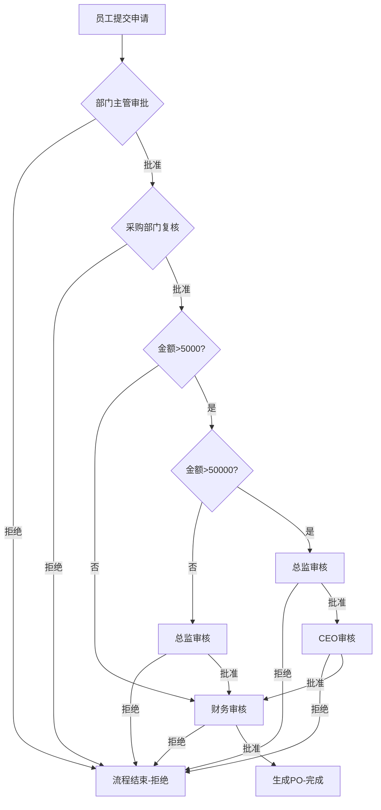

# 采购申请单流程 - 实现规划

## 1. 需求分析

### 1.1 业务流程概述

```
员工提单（需求方）→ 部门主管初审 → 采购部门复核 → 高管分级审批 → 财务审核 → 结束/生成采购订单(PO)
```

### 1.2 金额条件分支

| 金额范围 | 流程路径 |
| :--- | :--- |
| ≤ 5,000 元 | 采购部门 → 财务审核 |
| 5,000 < 金额 ≤ 50,000 元 | 采购部门 → 总监审核 → 财务审核 |
| > 50,000 元 | 采购部门 → 总监审核 → CEO审核 → 财务审核 |

### 1.3 审批角色定义

| 角色 | 说明 |
| :--- | :--- |
| EMPLOYEE | 员工（提单） |
| MANAGER | 部门主管（初审） |
| PURCHASING | 采购部门（复核） |
| DIRECTOR | 总监（分级审批） |
| CEO | 首席执行官（重大支出审批） |
| FINANCE | 财务部门（审核） |

### 1.4 状态定义

| 状态码 | 状态名称 | 说明 |
| :--- | :--- | :--- |
| PENDING | 待审批 | 申请已提交 |
| DEPARTMENT_REVIEW | 部门主管初审 | 等待部门主管审批 |
| PURCHASING_REVIEW | 采购复核 | 等待采购部门复核 |
| DIRECTOR_REVIEW | 总监审核 | 等待总监审核 |
| CEO_REVIEW | CEO审核 | 等待CEO审核 |
| FINANCE_REVIEW | 财务审核 | 等待财务审核 |
| COMPLETED | 已完成 | 所有审批通过，生成PO |
| REJECTED | 已拒绝 | 任一环节拒绝 |
| CANCELLED | 已取消 | 申请人取消 |

---

## 2. 技术实现方案

### 2.1 新增实体

#### 采购申请表 (purchase_applications)

| 字段名 | 类型 | 约束 | 说明 |
| :--- | :--- | :--- | :--- |
| id | UUID | PRIMARY KEY | 申请唯一标识 |
| applicant_id | UUID | FOREIGN KEY | 申请人ID |
| amount | DECIMAL(12,2) | NOT NULL | 采购金额 |
| description | VARCHAR(500) | | 采购说明 |
| supplier | VARCHAR(200) | | 供应商名称 |
| status | VARCHAR(30) | NOT NULL | 当前状态 |
| po_number | VARCHAR(50) | | 生成的PO编号 |
| created_at | TIMESTAMP | DEFAULT CURRENT_TIMESTAMP | 创建时间 |
| updated_at | TIMESTAMP | DEFAULT CURRENT_TIMESTAMP | 更新时间 |

### 2.2 新增角色

在 `UserRole` 枚举中添加：
- `PURCHASING` - 采购部门
- `CEO` - 首席执行官

> 注：DIRECTOR 角色已存在于现有系统中

### 2.3 模块结构

```
src/
└── purchase/
    ├── purchase.module.ts
    ├── purchase.controller.ts
    ├── purchase.service.ts
    ├── purchase.entity.ts
    └── dto/
        ├── create-purchase.dto.ts
        └── approval.dto.ts
```

### 2.4 API 接口设计

| HTTP方法 | 路径 | 功能描述 |
| :--- | :--- | :--- |
| POST | /purchase/apply | 提交采购申请 |
| GET | /purchase | 获取采购申请列表 |
| GET | /purchase/:id | 获取采购申请详情 |
| PUT | /purchase/:id/approve | 审批采购申请 |
| PUT | /purchase/:id/reject | 拒绝采购申请 |
| DELETE | /purchase/:id | 取消采购申请 |

---

## 3. 审批流程逻辑



### 3.1 流程状态流转

```
PENDING → DEPARTMENT_REVIEW → PURCHASING_REVIEW → [DIRECTOR_REVIEW] → [CEO_REVIEW] → FINANCE_REVIEW → COMPLETED
                                                    ↑                 ↑
                                               金额>5000           金额>50000
```

---

## 4. 权限控制

| 角色 | 可审批环节 | 可见范围 |
| :--- | :--- | :--- |
| ADMIN | 所有环节 | 所有申请 |
| IT | 所有环节 | 所有申请 |
| MANAGER | 部门主管初审（本部门） | 本部门申请 |
| PURCHASING | 采购复核 | 所有申请 |
| DIRECTOR | 总监审核 | 所有申请 |
| CEO | CEO审核 | 所有申请 |
| FINANCE | 财务审核 | 所有申请 |
| EMPLOYEE | 无 | 自己的申请 |

---

## 5. 实现步骤

| 步骤 | 任务 | 描述 |
| :--- | :--- | :--- |
| 1 | 更新用户角色 | 在 user.entity.ts 中添加 PURCHASING, CEO 角色 |
| 2 | 创建采购实体 | 创建 purchase.entity.ts |
| 3 | 创建 DTO | 创建 create-purchase.dto.ts 和 approval.dto.ts |
| 4 | 创建服务 | 创建 purchase.service.ts |
| 5 | 创建控制器 | 创建 purchase.controller.ts |
| 6 | 更新模块 | 创建 purchase.module.ts 并更新 app.module.ts |
| 7 | 构建测试 | 运行构建验证 |

---

**版本**: v1.1  
**创建日期**: 2026-06-14  
**状态**: 待审批